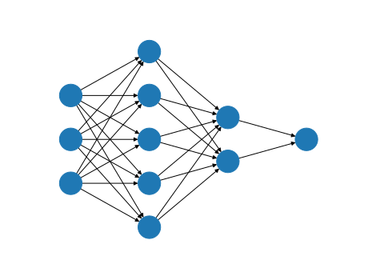

# Machine Learning Porfolio - Tim Tiemens

   

I am an experienced "traditional" software engineer switching to a career as a Machine Learning Engineer.

The pieces of my Machine Learning experiences are already quite scattered, so here is a place that brings them all together in one place.

Table of contents

 * [Original Projects](#original-projects)
 * [My External Links](#my-external-links)
 * [Posts](#posts)
 * [Courses and Certifications](#courses-and-certifications)

----

## Original Projects

 * [ml-style-transfer](https://github.com/timtiemens/ml-style-transfer) Implementation of Neural Style Transfer that allows easy hyperparameter experimentation.
   * [ml-style-transfer-samples](https://github.com/timtiemens/ml-style-transfer-samples) Some interesting outcomes from experiments with different styles, etc.
 * [tic-tac-toe dataset analysis](https://github.com/timtiemens/tictactoe) Analysis of the [Kaggle Tic-Tac-Toe End game Dataset] and code that shows how it was created and more.
 * [tic-tac-toe Kaggle dataset contribution](https://www.kaggle.com/datasets/ttiemens/tic-tac-toe-all-outcomes-and-turns?datasetId=3394123) packaged release of Tic Tac Toe complete Dataset to Kaggle.

## My External Links

 * [LinkedIn](https://www.linkedin.com/in/tim-tiemens-61a6957/)
 * [GitHub](https://github.com/timtiemens)
 * [Blog](http://tiemensfamily.com/timoncs)

## Posts

 * [Kaggle, JSON, Python and pandas](http://tiemensfamily.com/timoncs/2023/03/17/kaggle-json-python-and-pandas/)
 * [Aha!](http://tiemensfamily.com/timoncs/2023/04/08/read-do-aha/)
 

## Courses and Certifications

#### &#9989; Machine Learning Specialization (2023 Feb) [[Specialization home page](https://www.coursera.org/specializations/machine-learning-introduction)]  [[Certificate](https://coursera.org/share/80f01680f536f1f6db088ba5bf3fd7b4)]

* &#9989; Supervised Machine Learning: Regression and Classification
 [[Course home page](https://www.coursera.org/learn/machine-learning/)]
 [[Certificate](https://coursera.org/share/d5e0886a15855604b2c8f9a85dd11c33)]

* &#9989; Advanced Learning Algorithms
 [[Course home page](https://www.coursera.org/learn/advanced-learning-algorithms)]
 [[Certificate](https://coursera.org/share/b7f5cb59c427f79a87cd2661f50067d8)]

* &#9989; Unsupervised Learning, Recommenders, Reinforcement Learning
 [[Course home page](https://www.coursera.org/learn/unsupervised-learning-recommenders-reinforcement-learning)]
 [[Certificate](https://coursera.org/share/67da5f33a46db1c531bcb0656e645735)]

#### Deep Learning Specialization (in progress) [[Specialization home page](https://www.coursera.org/specializations/deep-learning)]  [Certificate TBD]

* &#9989; Neural Networks and Deep Learning
 [[Course home page](https://www.coursera.org/learn/neural-networks-deep-learning)]
 [[Certificate](https://coursera.org/share/b71eba6b242198b6f111e57081cc972b)]

* &#9989; Improving Deep Neural Networks: Hyperparameter Tuning, Regularization and Optimization
 [[Course home page](https://www.coursera.org/learn/deep-neural-network)]
 [[Certificate](https://www.coursera.org/account/accomplishments/certificate/P2GCRNZBYZ2B)]

* &#9989; Structuring Machine Learning Projects
 [[Course home page](https://www.coursera.org/learn/machine-learning-projects)]
 [[Certificate](https://www.coursera.org/account/accomplishments/certificate/LLL834Q3YWNU)]

* &#9989; Convolutional Neural Networks
 [[Course home page](https://www.coursera.org/learn/convolutional-neural-networks)]
 [[Certificate](https://coursera.org/share/32215c9bb3c4ba021d77387222afbe9f)]

* &#10146; Sequence Models
 [[Course home page](https://www.coursera.org/learn/nlp-sequence-models)]
 [Certificate TBD]

[Kaggle Tic-Tac-Toe End game Dataset]:https://www.kaggle.com/datasets/aungpyaeap/tictactoe-endgame-dataset-uci
